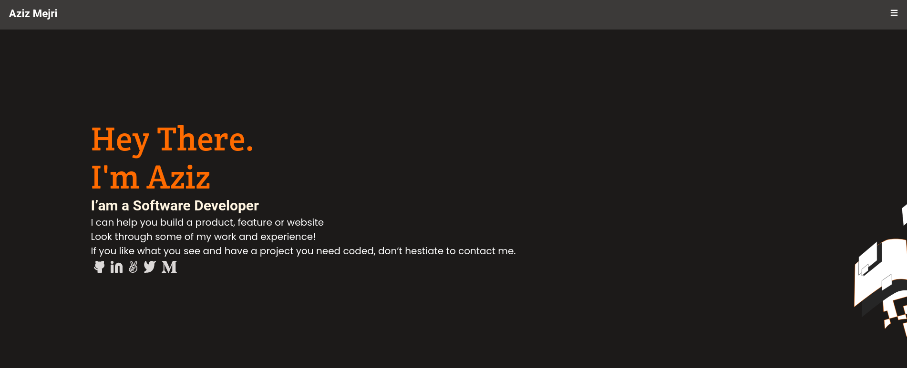

# Portofolio

> A portofolio webpage that displays all the projects I've been working on recently. 

## Live Demo
Use the link below to access github page for my portofolio.

- [Github_Page](https://zhadier.github.io/Contact-Form-Reviewable/)

## Built With

- HTML
- CSS
- VSCODE

## Getting Started
#### Step 1:

- Clone this repo locally using git in the command line and the following command

  git clone https://github.com/zhadier/Contact-Form-Reviewable
  
- Alternatively, you can just download the complete zip file and extract the folder in your directory

#### Step 2:
Copy All Project files and run using VSCODE. HTML can be viewed in browser.

### Prerequisites
- VSCODE

### Usage
- For display for potential Hirers.

## Authors
- GitHub: [@zhadier](https://github.com/zhadier)
- LinkedIn: [Zeeshan Haider](https://www.linkedin.com/in/zhadier39/)
## 🤝 Contributing

Contributions, issues, and feature requests are welcome and highly encouraged!
We feel that your input is what helps us grow so you're always Welcome :)

Feel free to check the [issues page](../../issues/).

## Show your support

Give a ⭐️ if you like this project!
We would love to hear your thoughts and ideas 🖤

## 📝 License

This project is [MIT](./MIT.md) licensed.
